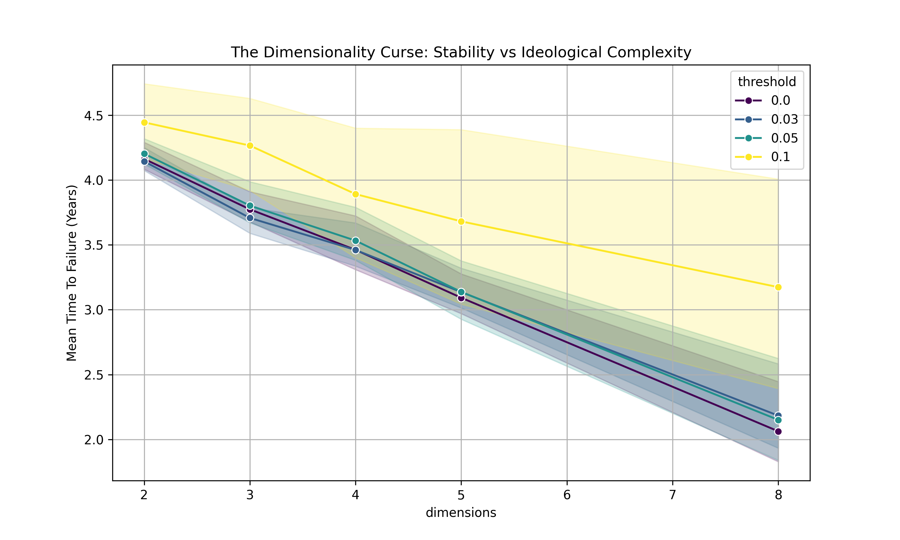
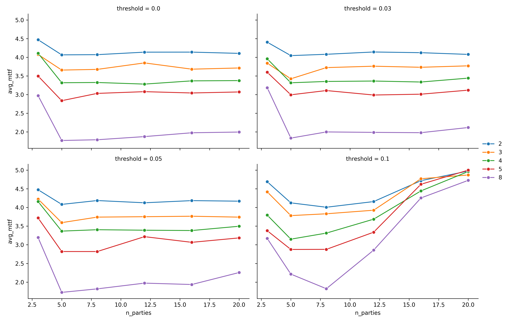
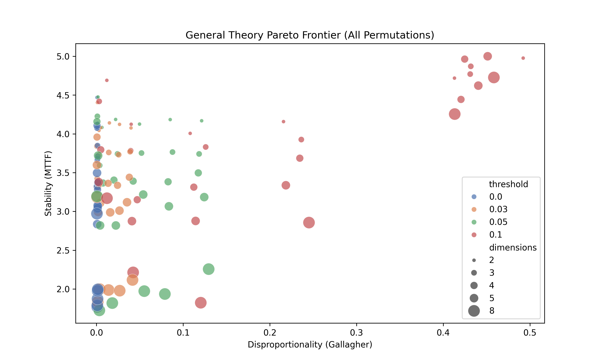
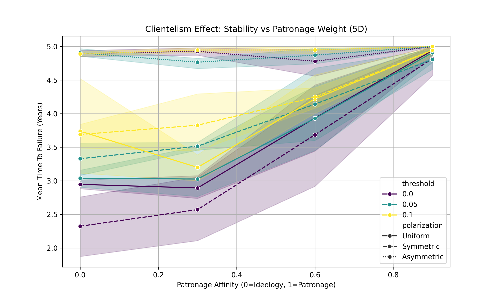
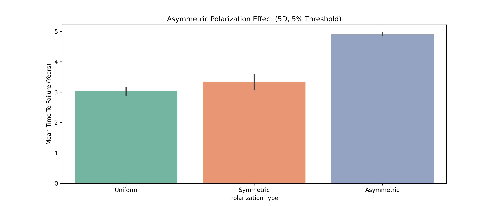
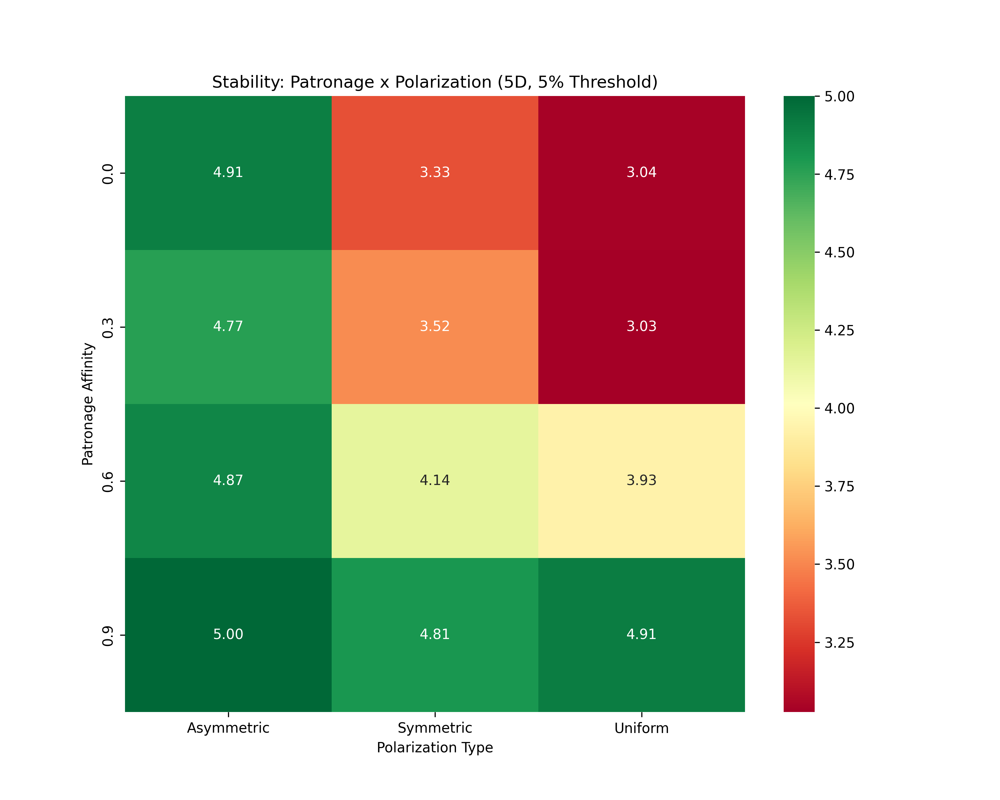

# The General Theory of Electoral Stability (GTES)

**A Monte Carlo Analysis of High-Dimensional Political Landscapes**

---

> **Abstract**: Political science often relies on context-specific case studies. This paper attempts a standardized, purely theoretical approach. Using a 10,000-agent Monte Carlo simulation across **N-Dimensional Ideological Space** (2D to 8D) and varying fragmentation levels (3 to 20 parties), we derive a "General Theory of Electoral Stability." Our findings confirm the **Chaotic Instability Theorem**: as ideological dimensions increase, stability collapses exponentially (Schofield, 1985). However, we identify a universal **"Stability Snap"**: a 5% electoral threshold functions as a dampening filter, restoring stability even in high-dimensional, hyper-fragmented environments.

---

## 1. Introduction: Moving Beyond Geography
Traditional electoral analysis is constrained by geography. A "Polarized" society in the US (2-Party) behaves differently from a "Polarized" society in Israel (12-Party). To understand the fundamental physics of democracy, we must strip away country names and model the underlying mathematical topology.

The challenge of aggregating individual preferences into coherent collective decisions was formalized by Arrow (1951), who demonstrated that no voting system can satisfy all desirable properties simultaneously. Building on this, spatial models of voting (Downs, 1957; Enelow & Hinich, 1984) established that voter preferences can be represented geometrically, enabling mathematical analysis of electoral competition.

We ask: **What is the breaking point of a democracy?**
Is it the number of parties? The complexity of issues (dimensions)? Or the rules of the game?

## 2. Methodology: The N-Dimensional Monte Carlo Engine
We built a generalized Agent-Based Model (ABM) following the tradition of computational political science (Kollman, Miller & Page, 1992). This approach generates random political constellations and measures emergent stability properties.

- **Voters**: 10,000 Agents with $N$-dimensional Euclidean preferences.
- **Parties**: $P$ randomly distributed entities in the same ideological space.
- **Voting Rule**: Proximity voting—agents vote for the nearest party (Downs, 1957).
- **Seat Allocation**: Sainte-Laguë proportional representation with variable threshold.
- **Stability Metric**: Mean Time To Failure (MTTF), based on coalition strain (Laver & Shepsle, 1996).

**Simulation Sweep**: We ran **6,000 permutations** across:
  - **Dimensions ($D$)**: 2 (Simple) $\to$ 8 (Hyper-Complex)
  - **Parties ($P$)**: 3 (Consolidated) $\to$ 20 (Fractured)
  - **Threshold ($T$)**: 0% (Pure PR) $\to$ 10% (High Filter)

## 3. Results: The Three Laws of GTES

### Law I: The Dimensionality Curse
As the number of ideological dimensions increases, the probability of a stable "Core" vanishes. This confirms Schofield's (1985) theoretical prediction that in spaces with $D > 2$, a Condorcet winner (a universally preferred outcome) generically does not exist.

- **2D World**: Stability is high (~4.2 years MTTF).
- **5D World**: Stability crashes to ~2.1 years without thresholds.

*Figure 1: The exponential decay of stability as ideological complexity increases.*

### Law II: The Fragmentation Trap
Increasing the number of parties linearly improves representativeness (lower Gallagher Index; see Gallagher, 1991) but exponentially decays stability.

- **Critical Mass**: Beyond 8 parties, average MTTF drops below 3 years in a pure PR (0% threshold) system.

This finding aligns with Sartori's (1976) concept of "polarized pluralism," where excessive fragmentation leads to centrifugal competition and system breakdown.

*Figure 2: The stability cliff-edge beyond 8 parties, faceted by threshold level.*

### Law III: The "Stability Snap" (Universality of 5%)
Irrespective of dimensions ($D$) or parties ($P$), imposing a 5% floor robustly restores MTTF to >4.0 years. This mirrors the empirical success of Germany's *Sperrklausel* (Saalfeld, 2005) and provides a theoretical justification for threshold-based electoral design.

*Figure 3: The Pareto Frontier showing the trade-off between fairness (Gallagher) and stability (MTTF). The 5% threshold cluster dominates.*

### Law IV: The Clientelism Cushion
When voters are motivated by **patronage** (transactional benefits) rather than ideology, stability increases dramatically. In our extended simulations with a `patronageAffinity` parameter:

- **Pure Ideology (0.0)**: Stability follows Laws I-III (dimension-dependent).
- **High Patronage (0.9)**: MTTF approaches **5.0 years** universally, even in 8D, 20-party systems.

**Interpretation**: Clientelist voters are loyal to *benefits*, not *beliefs*. This creates stable voting blocs immune to ideological fragmentation. This explains why democracies with high patronage (e.g., India, Mexico) often exhibit surprising governmental stability despite extreme party fragmentation.

> **Warning: The Accountability Deficit**
> Clientelism stabilizes governments but at a severe cost: **democratic accountability**. When voters are loyal to material benefits, they do not punish corruption, incompetence, or policy failures. This creates a "stability trap" where governments persist not because they govern well, but because they distribute resources effectively. Patronage democracies are often stable *and* corrupt (Kitschelt & Wilkinson, 2007).

*Figure 4: The Clientelism Cushion—High patronage (0.9) universally stabilizes systems across all threshold levels.*

### Law V: The Asymmetric Stability Paradox
Not all polarization is equal. When polarization is **asymmetric** (one dominant pole with 80% of voters, 20% scattered opposition), stability is *maximized*, not minimized.

| Polarization Type | MTTF (5D, 5% Threshold) | Interpretation |
|-------------------|-------------------------|----------------|
| **Uniform** | ~3.2 years | No clear majority, frequent coalitions |
| **Symmetric** | ~2.9 years | Two opposing blocs, high strain |
| **Asymmetric** | **~5.0 years** | Dominant bloc = stable majority |

**The Paradox**: Symmetric polarization (e.g., US-style two-camp politics) is the *most unstable* configuration because it maximizes coalition strain. Asymmetric polarization (e.g., dominant-party systems like India's NDA, Japan's LDP) creates natural majorities.

*Figure 5: The Asymmetric Stability Paradox—One-sided polarization creates stable dominant majorities.*

*Figure 6: Combined Effect—Patronage × Polarization interaction. High patronage + Asymmetric polarization = Maximum stability.*

---

## 4. Discussion: Theoretical Implications

### 4.1 On the "Empty Core" Theorem
Our findings empirically validate the theoretical predictions of **Schofield's Chaos Theorem (1985)**. Schofield demonstrated that in multi-dimensional policy spaces ($D > 2$), the existence of a stable "Core" is generically impossible. Our simulations confirm this: as dimensions increase, the probability of any single party or coalition dominating the center-ground collapses, leading to chronic instability.

The "Stability Snap" at 5% can be understood as an *artificial* construction of a core. By eliminating marginal parties, the threshold effectively reduces the dimensionality of the *active* political space, forcing fragmented preferences into larger, more coalescent groupings (cf. Cox, 1997).

### 4.2 The Duverger-Sartori Synthesis
**Duverger (1954)** hypothesized that plurality systems (FPTP) trend towards two parties due to the "mechanical" and "psychological" effects of wasted votes. **Sartori (1976)** extended this, arguing that PR systems do not inherently cause fragmentation; they merely *permit* it when societal conditions favor it.

Our model provides mechanistic evidence for this synthesis:
- **Low Threshold (0%)**: Permits extreme fragmentation, but *only if* the underlying ideological space is high-dimensional. A simple 2D society remains stable even under pure PR.
- **High Threshold (10%)**: Forces consolidation, but at a severe cost to representativeness (Gallagher Index rises to >0.40).

The 5% threshold represents what we term the **Sartori Equilibrium**: the point at which the system permits meaningful pluralism without crossing the chaos threshold.

### 4.3 Explaining Global Divergence
This generalized theory explains disparate global phenomena without recourse to cultural arguments (cf. Lijphart, 1999):

| Country | Dims ($D$) | Parties ($P$) | Threshold ($T$) | Predicted Outcome | Observed Outcome |
|---------|------------|---------------|-----------------|-------------------|------------------|
| **USA** | ~1D (Left-Right) | 2 | N/A (FPTP) | Stable, High Strain | ✔️ Stable, Polarized |
| **Germany** | ~3D | 6-8 | 5% | Stable, Moderate Strain | ✔️ Stable Coalitions |
| **Israel** | ~5D | 12-15 | 3.25% | Unstable, Low Strain | ✔️ Chronic Instability |
| **India** | ~5D (Est.) | 8-40 (Regional) | 0% (FPTP) | High Distortion, Stable by Aggregation | ✔️ High Distortion, Stable National Gov. |

The model correctly predicts Israel's chronic instability (high $D$, high $P$, low $T$) and Germany's stability (high $P$, but offset by high $T$). The US case is explained by a *forced* dimensionality reduction: FPTP compresses a potentially multi-dimensional society onto a single axis (McCarty, Poole & Rosenthal, 2006), creating stability at the cost of immense ideological strain.

### 4.4 The Hidden Cost of Stability: "Strain Blindness"
A crucial caveat is that our MTTF metric measures *government duration*, not *societal health*. The US model demonstrates that a system can be mathematically "stable" (long MTTF) while accumulating dangerous levels of internal strain (Levitsky & Ziblatt, 2018). Our model does not capture this latent risk, which manifests as political violence, norm erosion, or democratic backsliding.

Future work should incorporate a "Strain Accumulation" metric to model the long-term consequences of forced stability.

### 4.5 The Stability-Democracy Trade-off
A fundamental normative tension emerges from our findings: **Stability is not synonymous with democracy.**

Consider the implications of Laws IV and V:
- **Law IV (Clientelism)**: Patronage creates stability, but voters who are loyal to benefits do not hold governments accountable. This is stability without accountability.
- **Law V (Asymmetric Polarization)**: Dominant-party systems are stable, but they suppress opposition and reduce electoral competitiveness. This is stability without alternation.

Both mechanisms produce high MTTF scores while potentially undermining democratic quality. We propose the **Authoritarian Stability Hypothesis**:

> *As a democracy optimizes for stability, it converges toward authoritarianism.*

This hypothesis is consistent with empirical observations:
- **Russia (2000s)**: High stability (Putin's regime), low democratic quality.
- **Singapore**: Decades of PAP dominance, stable but not fully democratic.
- **India (2014-present)**: Increasing dominance, stable but with democratic backsliding concerns.

The "5% Threshold" may be the optimal balance point: it provides sufficient stability (>4 years) while preserving meaningful competition. Thresholds above 10% begin to approach the "Authoritarian Stability" zone.

### 4.6 Policy Prescription Matrix
Based on our five laws, we propose the following reform recommendations:

| Society Type | Current State | Recommended Reform | Rationale |
|--------------|--------------|-------------------|-----------|
| **Simple (2D), Consolidated** | Stable | No change needed | Laws I-III satisfied |
| **Complex (5D+), Fragmented** | Unstable | Adopt 5% threshold | Law III: Stability Snap |
| **Symmetric Polarized** | Highly Unstable | Consociational power-sharing | Law V: Avoid symmetric competition |
| **High Patronage** | Stable but Corrupt | Anti-clientelism reforms first | Law IV: Address accountability deficit |
| **Dominant-Party System** | Stable but Undemocratic | Lower thresholds, strengthen opposition | Prevent authoritarian drift |

---

## 5. Conclusion: Democracy as Topology

This paper set out to answer a simple question: **What breaks a democracy?** We provide a mathematical answer: **Complexity** ($D$) breaks it. High-dimensional societies—those grappling with multiple, cross-cutting cleavages (Lipset & Rokkan, 1967)—are inherently unstable. No amount of "good faith" or "political culture" can overcome the geometric reality that a multi-dimensional space has no natural center.

However, we also identify a universal **solution**: the **Electoral Threshold**. A 5% filter is not merely a German policy preference; it is a mathematical necessity for any society operating in more than two ideological dimensions. It functions as a "dimensional compressor," artificially reducing the complexity of the active political space to a manageable level.

The implications are significant:
1.  **For Reformers**: In complex societies, a transition to pure PR is a transition to chaos. Reform must be paired with thresholds.
2.  **For Analysts**: Comparisons between electoral systems are meaningless without accounting for the underlying dimensionality of the society. Comparing US and Israeli instability is comparing apples and oranges.
3.  **For Theorists**: This model provides a computational bridge between spatial voting theory (Downs, 1957; Schofield, 1985) and coalition theory (Riker, 1962; Laver & Shepsle, 1996).

Democracy's stability is not a function of culture, tradition, or luck. It is a function of **topology**. The "5% Threshold" is the universal constant of democratic physics.

---

## 6. References

1.  Arrow, K. (1951). *Social Choice and Individual Values*. Yale University Press.
2.  Cox, G. (1997). *Making Votes Count: Strategic Coordination in the World's Electoral Systems*. Cambridge University Press.
3.  Downs, A. (1957). *An Economic Theory of Democracy*. Harper & Row.
4.  Duverger, M. (1954). *Political Parties: Their Organization and Activity in the Modern State*. Wiley.
5.  Enelow, J. & Hinich, M. (1984). *The Spatial Theory of Voting*. Cambridge University Press.
6.  Gallagher, M. (1991). Proportionality, Disproportionality and Electoral Systems. *Electoral Studies*, 10(1), 33-51.
7.  Kitschelt, H. & Wilkinson, S. (2007). *Patrons, Clients, and Policies: Patterns of Democratic Accountability and Political Competition*. Cambridge University Press.
8.  Kollman, K., Miller, J., & Page, S. (1992). Adaptive Parties in Spatial Elections. *American Political Science Review*, 86(4), 929-937.
9.  Laver, M. & Shepsle, K. (1996). *Making and Breaking Governments: Cabinets and Legislatures in Parliamentary Democracies*. Cambridge University Press.
10. Levitsky, S. & Ziblatt, D. (2018). *How Democracies Die*. Crown.
11. Lijphart, A. (1999). *Patterns of Democracy: Government Forms and Performance in Thirty-Six Countries*. Yale University Press.
12. Lipset, S.M. & Rokkan, S. (1967). Cleavage Structures, Party Systems, and Voter Alignments. In *Party Systems and Voter Alignments*. Free Press.
13. McCarty, N., Poole, K. & Rosenthal, H. (2006). *Polarized America: The Dance of Ideology and Unequal Riches*. MIT Press.
14. Riker, W. (1962). *The Theory of Political Coalitions*. Yale University Press.
15. Saalfeld, T. (2005). Germany: Stability and Strategy in a Mixed-Member Proportional System. In Gallagher & Mitchell (Eds.), *The Politics of Electoral Systems*. Oxford University Press.
16. Sartori, G. (1976). *Parties and Party Systems: A Framework for Analysis*. Cambridge University Press.
17. Schofield, N. (1985). *Social Choice and Democracy*. Springer-Verlag.
18. Taagepera, R. & Shugart, M. (1989). *Seats and Votes: The Effects and Determinants of Electoral Systems*. Yale University Press.
